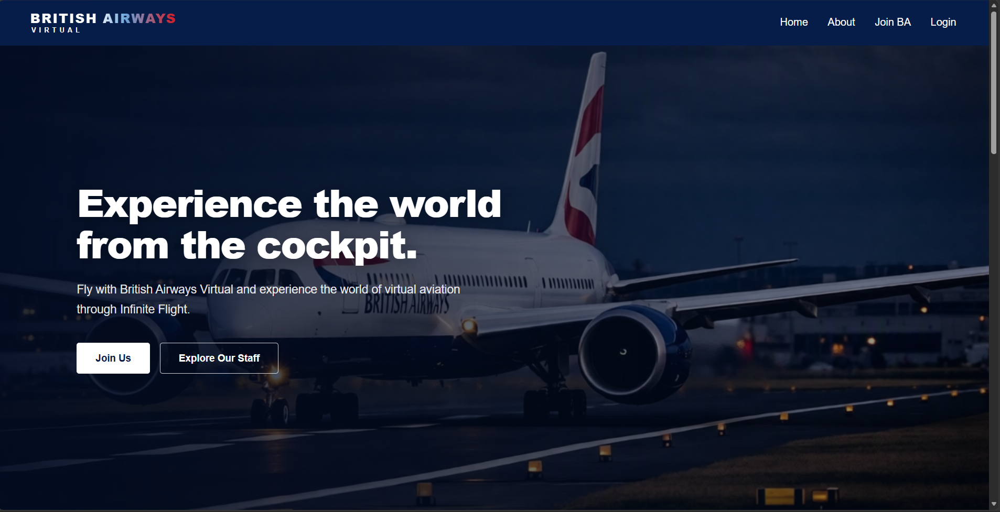
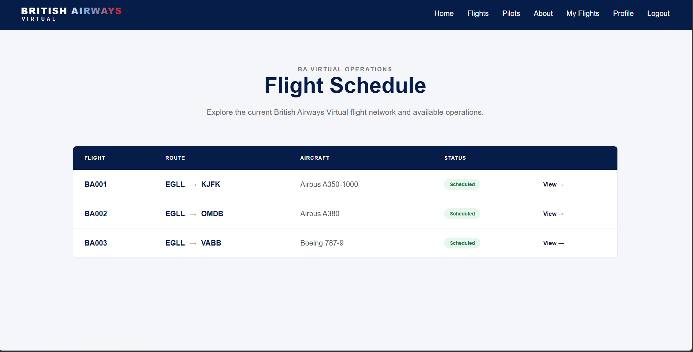
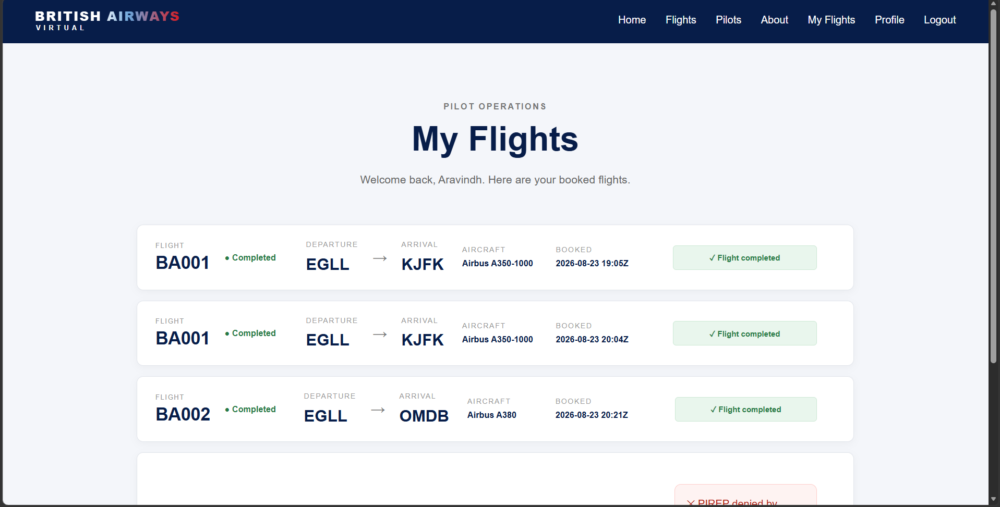
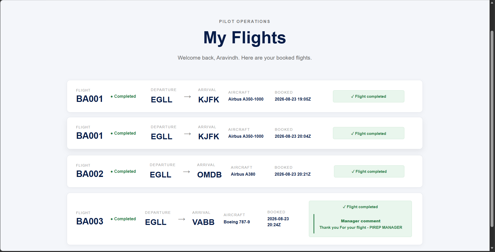
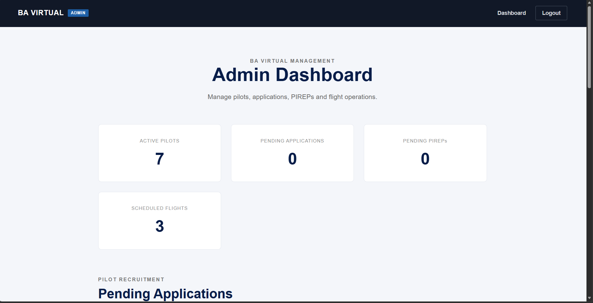
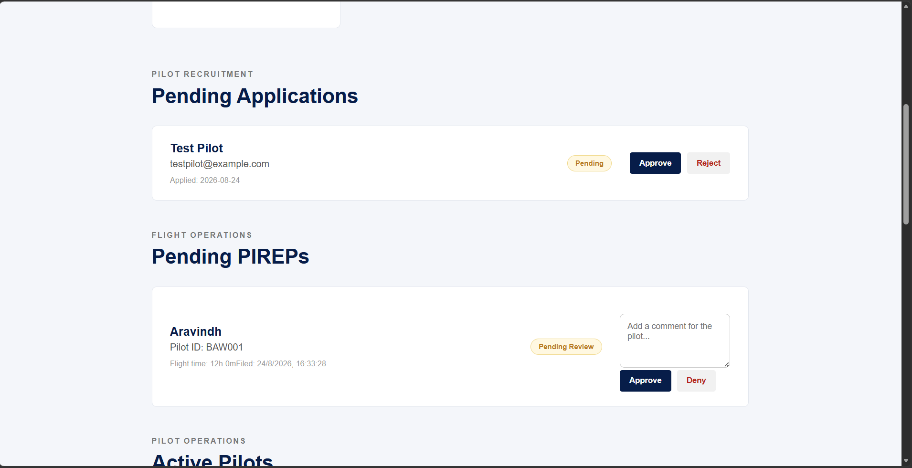

# ✈️ British Airways Virtual

### A modern virtual airline management platform built for Infinite Flight pilots.

British Airways Virtual is a web-based virtual airline platform designed to manage pilots, flights, bookings, applications, and PIREPs through a modern React interface.

Built with **React**, **Vite**, and a **REST API powered by JSON Server**.

---

## 🚀 Overview

British Airways Virtual provides a centralized platform for virtual airline operations, allowing pilots to manage their profiles, explore scheduled flights, book flights, and submit PIREPs.

The platform also includes an administrative interface for managing pilots, applications, flights, bookings, and PIREP reviews.

---

## ✨ Features

### 👨‍✈️ Pilot Management

- Pilot registration and login
- Pilot profiles and ranks
- Flight hours and flight statistics
- Pilot status management

### ✈️ Flight Operations

- View scheduled flights
- Flight details and route information
- Flight booking system
- Personal flight management

### 📝 PIREP System

- Submit completed flight reports
- Record flight times and details
- Flight bonus information
- PIREP approval and rejection
- Review comments from administrators

### 📋 Application Management

- Submit pilot applications
- Application approval and rejection
- Application status tracking

### 🛡️ Administration

- Administrative dashboard
- Pilot management
- Flight management
- Booking management
- PIREP review and management
- News and announcements

---

## 🛠️ Tech Stack

### Frontend

<p>
  
</p>

### API & Data

<p>
  
</p>

- **REST API**
- **JSON Server**
- **Fetch API**

### Development Tools

<p>
  
</p>

- Git
- GitHub
- Visual Studio Code

---

## 📁 Project Structure

````text
british-airways-virtual/
│
├── public/
│   ├── favicon.svg
│   └── icons.svg
│
├── src/
│   ├── assets/
│   │
│   ├── components/
│   │   ├── AdminLayout.jsx
│   │   ├── AdminNavbar.jsx
│   │   ├── Navbar.jsx
│   │   ├── PublicLayout.jsx
│   │   └── ScrollReveal.jsx
│   │
│   ├── pages/
│   │   ├── About.jsx
│   │   ├── Admin.jsx
│   │   ├── Dashboard.jsx
│   │   ├── FlightDetails.jsx
│   │   ├── Flights.jsx
│   │   ├── Home.jsx
│   │   ├── Login.jsx
│   │   ├── MyFlights.jsx
│   │   ├── PilotProfile.jsx
│   │   ├── Pilots.jsx
│   │   ├── Pirep.jsx
│   │   ├── Profile.jsx
│   │   └── Register.jsx
│   │
│   ├── services/
│   │   └── pilotService.js
│   │
│   ├── App.jsx
│   ├── App.css
│   ├── index.css
│   └── main.jsx
│
├── db.json
├── package.json
├── package-lock.json
├── vite.config.js
└── README.md

---

## ⚙️ Installation & Setup

### 1. Clone the repository

```bash
git clone https://github.com/Aravindhan-M02/british-airways-virtual.git

---

---

##  📸 Screenshots

### 🏠 Home



### ✈️ Flight Schedule



### 🧑‍✈️ My Flights



### 📝 Flight Comment / PIREP



### 🛡️ Admin Dashboard



### 👀 Admin Preview




## 📌 Project Status

🚧 **Currently under development**

British Airways Virtual is an ongoing project. New features, improvements, and operational tools will be added over time.

---

## 👨‍💻 Developer

**Aravindhan M**

Full Stack Developer

- GitHub: [@Aravindhan-M02](https://github.com/Aravindhan-M02)

---

⭐ If you find this project interesting, consider giving it a star!
````
